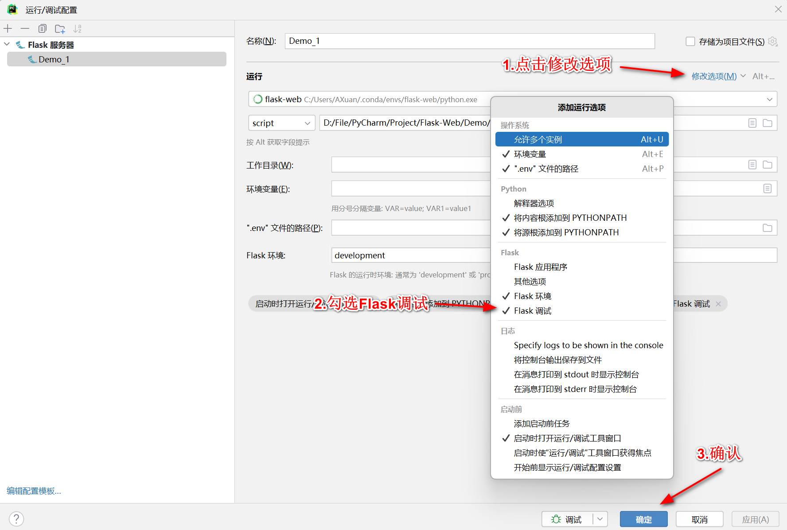
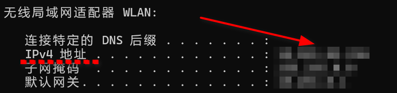
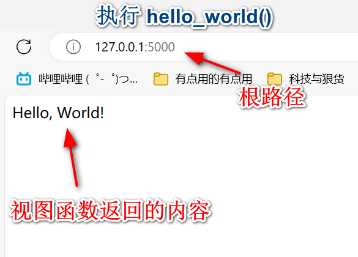
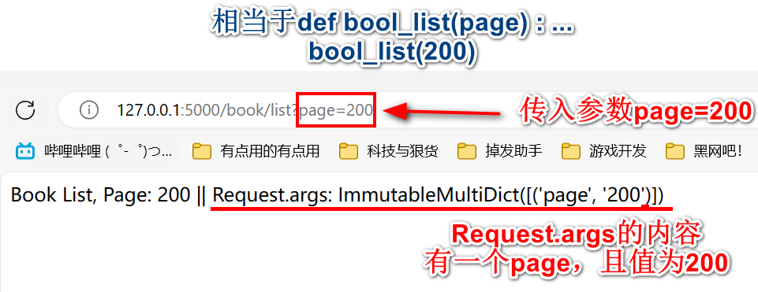
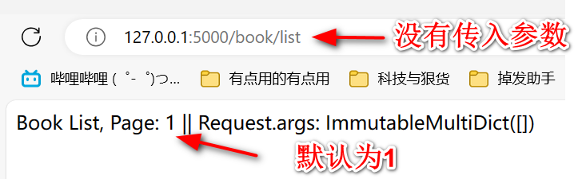

# Demo_1

>  知识点 ： **Debug模式 ||  Host修改 ||  Port修改**
>
>  代码位置 ：Flask-Web / Demo / Demo_1 / app.py 

## Debug模式

开启Debug模式后，在修改代码后会自动重新加载

两种调用方式:

1. 在app.run中传入debug参数

    ```python
    if __name__ == '__main__':
    	app.run(debug=True)
    ```

2. PyCharm的脚本编辑中添加

    

## 主机名Host修改

修改Host的作用是：让同一 **局域网** 下的电脑可以通过IP访问到我电脑上的Flask-Web应用

在无参数启动Flask时，它的Host为 `127.0.0.1`


可以通过向app.run()传入参数修改host

1. 通过CMD得知自己的IP地址

    ```cmd
    ipconfig
    ```

    

2. 给app.run传入参数

    ```python
    if __name__ == '__main__':
    	app.run(host='xx.xx.xx.xx')
    ```


## 端口Port修改

作用：当默认端口5000端口被其他程序占用时，通过修改Port来监听

在无参数启动时，默认端口是 `5000`

可通过向app.run()传入参数修改Port

```python
if __name__ == '__main__':
	app.run(port=5001)
```


# Demo_2

>   知识点：**URL 与 视图函数** 
>
> 代码位置 ：Flask-Web / Demo / Demo_2 / app.py

### URL

由以下部分组成：

* 协议：`https://`

* 主机名：`www.example.com`

* 端口：`443`

* 路径：`/path/to/resource`

* 查询参数：`param1=value1&param2=value2`

* 片段标识符：`section1`

    ```cmd
    https://www.example.com:443/path/to/resource?param1=value1&param2=value2#section1
    ```

对于`https://`协议而言，默认端口是443。在输入URL时，可以忽略端口

```cmd
https://www.example.com/path/to/resource?param1=value1&param2=value2#section1
```


### 视图函数

视图函数负责处理从客户端发送来的请求，并执行相应的逻辑，再返回一个HTTP响应给客户端。简单来说：**当进入某路径时，会执行函数(这个函数被称之为视图函数)，并返回一些内容**

视图函数由 `@app.route()` 定义

```python
# 例子
@app.route('/')  # 在进入根路径时，执行下面的视图函数
def hello_world():  # hello_world是视图函数
	return 'Hello, World!'
```


### URL与视图函数的连接

根路径的定义：只有 **协议/主机名/端口** 的URL

```
https://127.0.0.1:5000/First/Second
```

* 此时，`https://127.0.0.1:5000/`是根路径，而`First`和`Second`均为子路径

例子：

```python
@app.route('/')  # 此时代表根路径。在进入根路径时，执行下面的视图函数
def hello_world():
	return 'Hello, World!'


@app.route('/firefly')  # 在进入/firefly路径时，执行下面视图函数
def firefly():
	return 'Firefly!'
```




只要是函数，都会存在着 **参数**，如`def exp(p1)`就表示这个函数接受一个任意类型的参数

在URL与视图函数中，有两种方式可以为 **视图函数** 传入参数

需要注意的是，直观理解下：URL是调用函数的人，因此URL是 **传入参数** 的；而视图函数是函数本身，因此视图函数是 **接收函数** 的


#### <>调用法

在`@app.route('PATH')`中的路径中加上尖括号 <> 就代表着参数

```python
@app.route('/firefly/<ff_id>')
def firefly_id(ff_id):
	return 'Firefly ID: %s' % ff_id
```

* ff_id ：使用尖括号，因此ff_id为参数，在调用firefly_id中传入


**语法：**

URL：`PATH/<参数名>`

视图函数：`def function(参数名)`


**例子：**

`http://127.0.0.1:5000/firefly/1`

* 1为ff_id的值，被传入到firefly_id中

    

`http://127.0.0.1:5000/firefly/2`


`http://127.0.0.1:5000/firefly/SAM`

~~为什么不运行Demo_2的apps.py试试这会显示什么呢?~~


此外，还可以通过在尖括号内加入 **类型关键字** 来限定传入参数的类型

```python
@app.route('/firefly/<ff_id>/<int:ff_num>')  # ff_id不限制类型，而ff_num必须为整数
def firefly_id_num(ff_id, ff_num):
	return 'Firefly ID: %s, Num: %d' % (ff_id, ff_num)
```

* `ff_id`可以为任意类型
* `ff_num`被限制为 INT类型

**语法：**

 `<类型名:参数名>`

* 类型名可以为：
    * **string** : 字符串类型，可以接受除 `/` 之外的字符
    * **int** ： 整形
    * **float** ：浮点型
    * **path** ：路径，类似于string，但可以接受 `/`
    * **uuid** ：一组32位数的16进制
    * **any(A, B, C)** : A、B、C类型中的其中一种


#### ？调用法

通过 **request.args** 来获取参数，？作用于URL

```python
from flask import Flask, request  # 多了一个request

@app.route('/book/list')  # 注意，这里并没有使用<>来表示参数
def book_list():  # 注意，这里并没有传入参数
	# request.args是一个字典，存储了所有的查询字符串参数
	# 使用get方法获取'page'参数，如果没有则默认为1，类型为int
	page = request.args.get('page', default=1, type=int)

	return f'Book List, Page: {page} ||  Request.args: {request.args}'
```


**语法：**

URL调用 : ` [PATH]?参数名=参数值`

视图函数获取参数 : `request.args.get(参数名，default=默认值，type=类型)`


**例子：**

`http://127.0.0.1:5000/book/list?page=200`

* `?` 后面紧跟着的是 **参数名** 以及 **参数值**，此时`request.args`会存储page的值

    

`http://127.0.0.1:5000/book/list`

* 这里并没有用到`?`，那么`request.args.get()`就会使用 **默认值(default)**，从视图函数中可以得知它为1

    

