本文档是对Demo文件夹下的代码进行解析，并含括了Flask的知识点

可以结合 [Flask不太专业的实战教程](https://www.bilibili.com/video/BV121421C7kt/?spm_id_from=333.788&vd_source=c9b8ab6fce6b4986cf89061f00aa9dc4) 一同阅读


# Demo_1

>  知识点 ： **Debug模式 ||  Host修改 ||  Port修改**
>
>  代码位置 ：Flask-Web / Demo / Demo_1 / app.py 

## Debug模式

开启Debug模式后，在修改代码后会自动重新加载。**即在不断开运行的情况下，修改代码后能实时反映到网站上**

两种调用方式:

1. **[推荐]** 在app.run中传入debug参数

    * 仅限使用**Python配置文件**

    ```python
    if __name__ == '__main__':
    	app.run(debug=True)
    ```

2. PyCharm的脚本编辑中添加

    * Python配置文件和Flask服务器配置文件均可

    

## 主机名Host修改

修改Host的作用是：让同一 **局域网** 下的电脑可以通过IP访问到我电脑上的Flask-Web应用

在无参数启动Flask时，它的Host为 `127.0.0.1`

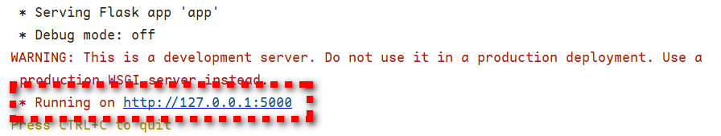

可以通过向app.run()传入参数修改host

1. 通过CMD得知自己的IP地址

    ```cmd
    ipconfig
    ```

    

2. 给app.run传入参数

    ```python
    if __name__ == '__main__':
    	app.run(host='xx.xx.xx.xx')
    ```

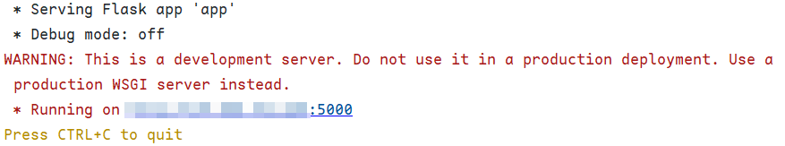

此时，别的在同一局域网下的设备(如校园网)可以通过此地址访问到你的网站

## 端口Port修改

作用：当默认端口5000端口被其他程序占用时，通过修改Port来监听

在无参数启动时，默认端口是 `5000`

可通过向app.run()传入参数修改Port

```python
if __name__ == '__main__':
	app.run(port=5001)
```

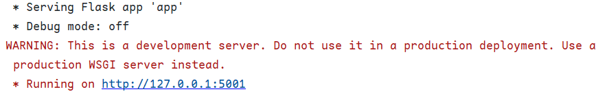


# Demo_2

>   知识点：**URL 与 视图函数** 
>
> 代码位置 ：Flask-Web / Demo / Demo_2 / app.py

### URL

由以下部分组成：

* 协议：`https://`

* 主机名：`www.example.com`

* 端口：`443`

* 路径：`/path/to/resource`

* 查询参数：`param1=value1&param2=value2`

* 片段标识符：`section1`

    ```cmd
    https://www.example.com:443/path/to/resource?param1=value1&param2=value2#section1
    ```

对于`https://`协议而言，默认端口是443。在输入URL时，可以忽略端口

```cmd
https://www.example.com/path/to/resource?param1=value1&param2=value2#section1
```


### 视图函数

视图函数负责处理从客户端发送来的请求，并执行相应的逻辑，再返回一个HTTP响应给客户端。简单来说：**当进入某路径时，会执行函数(这个函数被称之为视图函数)，并执行一些逻辑操作**

视图函数由 `@app.route()` 定义

```python
# 例子
@app.route('/')  # 在进入根路径时，执行下面的视图函数
def hello_world():  # hello_world是视图函数
	return 'Hello, World!'
```


### URL与视图函数的连接

根路径的定义：只有 **协议/主机名/端口** 的URL

```
https://127.0.0.1:5000/First/Second
```

* 此时，`https://127.0.0.1:5000/`是根路径，而`First`和`Second`均为子路径

例子：

```python
@app.route('/')  # 此时代表根路径。在进入根路径时，执行下面的视图函数
def hello_world():
	return 'Hello, World!'


@app.route('/firefly')  # 在进入/firefly路径时，执行下面视图函数
def firefly():
	return 'Firefly!'
```


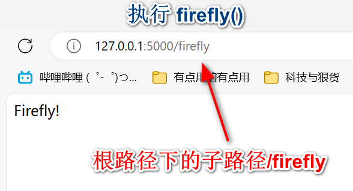


只要是函数，都会存在着 **参数**，如`def exp(p1)`就表示这个函数接受一个任意类型的参数

在URL与视图函数中，有两种方式可以为 **视图函数** 传入参数

需要注意的是，直观理解下：URL是调用函数的人，因此URL是 **传入参数** 的；而视图函数是函数本身，因此视图函数是 **接收函数** 的


#### 可变路径入参法

在`@app.route('PATH')`中的路径中加上尖括号 <> 就代表着参数

```python
@app.route('/firefly/<ff_id>')
def firefly_id(ff_id):
	return 'Firefly ID: %s' % ff_id
```

* ff_id ：使用尖括号，因此ff_id为参数，在调用firefly_id中传入


**语法：**

URL：`PATH/<参数名>`

视图函数：`def function(参数名)`


**例子：**

`http://127.0.0.1:5000/firefly/1`

* 1为ff_id的值，被传入到firefly_id中

    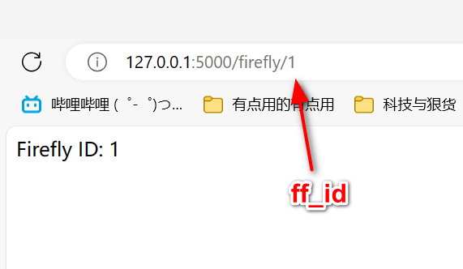

`http://127.0.0.1:5000/firefly/2`

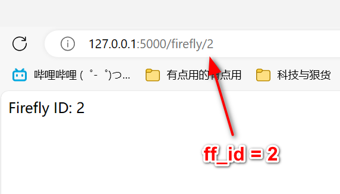

`http://127.0.0.1:5000/firefly/SAM`

~~为什么不运行Demo_2的apps.py试试这会显示什么呢?~~


此外，还可以通过在尖括号内加入 **类型关键字** 来限定传入参数的类型

```python
@app.route('/firefly/<ff_id>/<int:ff_num>')  # ff_id不限制类型，而ff_num必须为整数
def firefly_id_num(ff_id, ff_num):
	return 'Firefly ID: %s, Num: %d' % (ff_id, ff_num)
```

* `ff_id`可以为任意类型
* `ff_num`被限制为 INT类型

**语法：**

 `<类型名:参数名>`

* 类型名可以为：
    * **string** : 字符串类型，可以接受除 `/` 之外的字符
    * **int** ： 整形
    * **float** ：浮点型
    * **path** ：路径，类似于string，但可以接受 `/`
    * **uuid** ：一组32位数的16进制
    * **any(A, B, C)** : A、B、C类型中的其中一种


#### 查询字符串入参法
> [📖 CSDN：查询字符串是什么意思？](https://blog.csdn.net/vip_wangsai/article/details/51999108)

通过 **request.args** 来获取参数，？作用于URL

```python
from flask import Flask, request  # 多了一个request

@app.route('/book/list')  # 注意，这里并没有使用<>来表示参数
def book_list():  # 注意，这里并没有传入参数
	# request.args是一个字典，存储了所有的查询字符串参数
	# 使用get方法获取'page'参数，如果没有则默认为1，类型为int
	page = request.args.get('page', default=1, type=int)

	return f'Book List, Page: {page} ||  Request.args: {request.args}'
```


**语法：**

URL调用 : ` [PATH]?参数名=参数值`

视图函数获取参数 : `request.args.get(参数名，default=默认值，type=类型)`


**例子：**

`http://127.0.0.1:5000/book/list?page=200`

* `?` 后面紧跟着的是 **参数名** 以及 **参数值**，此时`request.args`会存储page的值

    

`http://127.0.0.1:5000/book/list`

* 这里并没有用到`?`，那么`request.args.get()`就会使用 **默认值(default)**，从视图函数中可以得知它为1

    


# Demo_3

>   知识点：**Flask与数据库的链接 | ORM模型**
>
> 代码位置：/Flask-Web/Demo/Demo_3/app.py 

## SQLAlchemy

SQLAlchemy是一个流行的Python SQL工具包和对象关系映射（ORM）工具。它允许开发人员**通过Python代码与关系型数据库进行交互**，而无需直接编写SQL语句。

## 连接数据库

### 完整代码

```python
from flask import Flask
from flask_sqlalchemy import SQLAlchemy
from sqlalchemy import text

## 设置app.config中关于数据库的参数
## SQLAlchemy(app)会自动从app.config中读取数据库的配置
# MySQL所在的主机名
HOSTNAME = '127.0.0.1'
# MySQL的监听端口号，默认3306
PORT = '3306'
# MySQL的用户名，在安装MySQL时由用户创建
USERNAME = 'root'
# MySQL的密码，在安装MySQL时由用户创建
PASSWORD = 'xxxxxx'
# MySQL的数据库名
DATABASE = 'flask-web'

# 创建app应用
app = Flask(__name__)
# 应用到app.config中
app.config['SQLALCHEMY_DATABASE_URI'] = f"mysql+pymysql://{USERNAME}:{PASSWORD}@{HOSTNAME}:{PORT}/{DATABASE}?charset=utf8"
# 连接SQLAlchemy到Flask应用
db = SQLAlchemy(app)
```

### 代码解析

若想将Flask和SQLAlchemy(数据库)连接，需要以下属性:

* **HOSTNAME**：SQL所在的主机名，此主机名与app相同，默认为`127.0.0.1`。若向app.run()传入`host = 'xxx.xxx.xxx.xxx'`，这HOSTNAME也需要同步进行修改

* **PORT**：SQL所需要的端口，此端口在创建SQL时指定，对于MySQL而言，默认端口号为`3306`。同时，也可以通过命令行的方式查询。

    * 对于MySQL，可按下Windows键后在搜索框中搜索MySQL，打开命令行工具

        

    * 在命令行中输入 `SHOW VARIABLES LIKE 'port';`

        

* **USERNAME**：SQL安装时的用户名，默认均为`root`。可通过在MySQL的命令行中输入`SELECT USER();`获取

    

* **PASSWORD**：SQL安装时指定的密码，没有默认密码

* **DATABASE**：需要链接到的数据库名。可通过在MySQL命令行中输入`SHOW DATABASES;`获取

    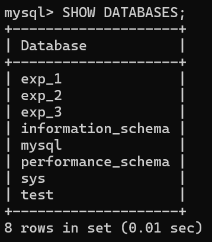

至此，对于SQL的基本属性就已经设置完成了，现在需要将这些基本属性载入到Flask的app中，然后将app与SQLAlchemy相连接。到此为止，Flask和SQLAlchemy就完成了基本链接

```python
# 创建app应用
app = Flask(__name__)
# 应用到app.config中
app.config['SQLALCHEMY_DATABASE_URI'] = f"mysql+pymysql://{USERNAME}:{PASSWORD}@{HOSTNAME}:{PORT}/{DATABASE}?charset=utf8"
# 连接SQLAlchemy到Flask应用
db = SQLAlchemy(app)
```

* 值得注意的是，在将SQL的基本属性设置到app时，可以通过修改`mysql+pymysql`来切换到不同的数据库。在本例子中，使用MySQL作为实例

### 检测数据库是否已经正常连接

可以通过代码：

```python
from sqlalchemy import text

with app.app_context():
	with db.engine.connect() as conn:
		# 使用text函数将字符串转换为可执行的SQLAlchemy对象
		rs = conn.execute(text('select 1'))
		print(rs.fetchone())  # Success : (1,)
```

* 注意，必须要加上`with app.app_context()`进行上下文管理，否则将会报错。详细报错信息可以查看[QA](./QA.md)

* `text('select 1')`中的text()函数来自`from sqlalchemy import text`，其目的是将`select 1`转换为SQLAlchemy对象

* 当连接成功后，将会输出:

    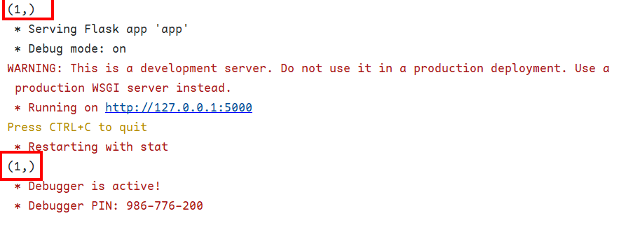

    


## 创建ORM模型

ORM（对象关系映射）是一种编程技术，它将关系型数据库中的表格和数据映射到编程语言中的对象模型上。简单来说，ORM模型就是 **表**

### ORM模型代码示例

```python
class Firefly(db.Model):
	__tablename__ = 'Firefly'
	id = db.Column(db.Integer, primary_key=True)
	username = db.Column(db.String(80), unique=True, nullable=False)  # varchar
	password = db.Column(db.String(80), nullable=False)
    
with app.app_context():
	db.create_all()  # 同步至数据库
```


### 代码解析

* **class User(db.Model)**：定义了一个名为User的类，类名实际上可以根据不同情况取名。该类继承于`db.Model`，这是一个SQLAlchemy框架的基类。当自定义类继承了该基类后，就说明这个类是一个 **ORM模型**
* **\_\_tablename\_\_ = 'User'**：定义了在数据库中，表的名称为`User`。若不指定`__tablename__`，则会默认使用 **类名的小写** 
* **id，username，password**：定义了表所拥有的字段名，此时在User表中一共有三个属性`id,username,password`
    * **db.Column()**：定义了表中字段的一些属性
        * `db.Integer`：字段类型为整数
        * `db.String(80)`：字段类型为Varchar，且长度为80
        * `primary_key=True`：字段为主键
        * `unique=True`：字段的值在表中是唯一的
        * `nullable=False`：字段的值不能为空
    * 对于定义字段的属性，详细看[字段常用属性](./扩展信息.md#字段常用属性)
* **with app.app_context():**：使Flask得知当前数据库的相关操作与app相关联
* **db.create_all**：检查所有继承`db.Model`的类，当该类所对应的`__tablename_`表不存在时，创建表；若存在，则无操作


### 运行

在未运行代码前，flask-web架构下无任何的表

在运行代码后，flask-web架构下多出了`user`表


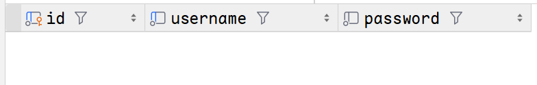

完整代码：

```python
from flask import Flask
from flask_sqlalchemy import SQLAlchemy
from sqlalchemy import text

## 设置app.config中关于数据库的参数
## SQLAlchemy(app)会自动从app.config中读取数据库的配置
# MySQL所在的主机名
HOSTNAME = '127.0.0.1'
# MySQL的监听端口号，默认3306
PORT = '3306'
# MySQL的用户名，在安装MySQL时由用户创建
USERNAME = 'root'
# MySQL的密码，在安装MySQL时由用户创建
PASSWORD = 'xxxxxx'  # TODO：修改成你的密码
# MySQL的数据库名
DATABASE = 'flask-web'

# 创建app应用
app = Flask(__name__)
# 应用到app.config中
app.config['SQLALCHEMY_DATABASE_URI'] = f"mysql+pymysql://{USERNAME}:{PASSWORD}@{HOSTNAME}:{PORT}/{DATABASE}?charset=utf8"
# 连接SQLAlchemy到Flask应用
db = SQLAlchemy(app)

class User(db.Model):
	__tablename__ = 'user'
	id = db.Column(db.Integer, primary_key=True)
	username = db.Column(db.String(80), unique=True, nullable=False)  # varchar
	password = db.Column(db.String(80), nullable=False)

with app.app_context():
	db.create_all()  # 同步至数据库
    
    
if __name__ == '__main__':
	app.run(debug=True)
```


## 插入数据 INSERT

### 代码示例

```python
@app.route('/add_user')
def add_user():
	# 创建ORM对象-共两条记录
	user_sam = User(id=1,username='sam', password='i will set the seas ablaze')
	user_firefly = User(id=2,username='firefly', password='i dreamed of a scorched earth')
	# 将ORM对象添加到db.session中
	db.session.add(user_sam)
	db.session.add(user_firefly)
	# 将db.session中的所有ORM对象同步到数据库
	db.session.commit()
	return 'Add User Success'
```

### 代码解析

* **@app.route('/add_user')**：在访问`http://127.0.0.1:5000/add_user`时会触发视图函数add_user()
* **创建ORM对象**：从[创建ORM模型](#创建ORM模型)中，我们定义了一个名为User的ORM模型。而每个User的 **实例**，都可以认为是 **一条记录**。
    * `user_sam = User(username='sam', password='i will set the seas ablaze')`，由于id是自动递增的，因此不需要显式赋值
* **将ORM对象添加到session中**：数据库会话（session）是SQLAlchemy用于追踪对象变化并将这些变化应用到数据库的机制。
    * 其语法是：`db.session.add(<ORM对象>)`
* **提交会话中的更改**：使用 `db.session.commit()` 将会话中的所有更改保存到数据库中。这会触发INSERT语句，将新用户记录插入到 `User` 表中

我们可以认为，从创建ORM模型到提交会话更改，是一条完整的 **INSERT** 语句。它对应着MySQL的 `INSERT user(username, password) VALUES('sam', 'i will set the seas ablaze')`

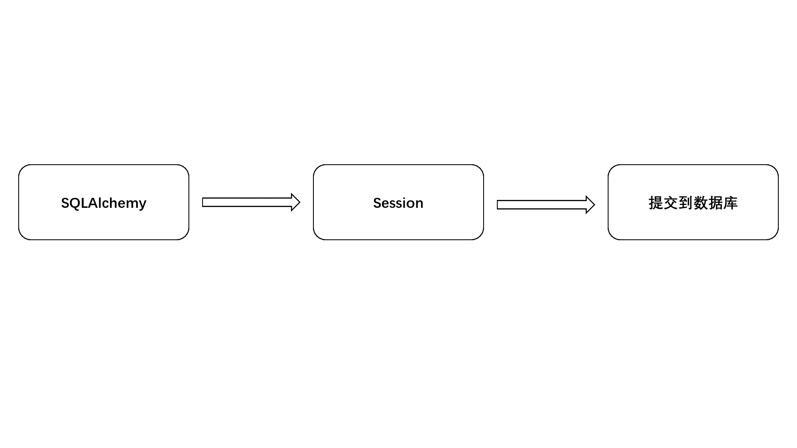

注意：当你重复执行视图函数，会因为数据库存在记录而报错

### 运行

1. 在浏览器中输入[127.0.0.1:5000/add_user](http://127.0.0.1:5000/add_user)

    

2. 查看User表的记录


完整代码：

```python
from flask import Flask
from flask_sqlalchemy import SQLAlchemy
from sqlalchemy import text

## 设置app.config中关于数据库的参数
## SQLAlchemy(app)会自动从app.config中读取数据库的配置
# MySQL所在的主机名
HOSTNAME = '127.0.0.1'
# MySQL的监听端口号，默认3306
PORT = '3306'
# MySQL的用户名，在安装MySQL时由用户创建
USERNAME = 'root'
# MySQL的密码，在安装MySQL时由用户创建
PASSWORD = 'xxxxx'  # TODO:替换你的密码
# MySQL的数据库名
DATABASE = 'flask-web'

# 创建app应用
app = Flask(__name__)
# 应用到app.config中
app.config['SQLALCHEMY_DATABASE_URI'] = f"mysql+pymysql://{USERNAME}:{PASSWORD}@{HOSTNAME}:{PORT}/{DATABASE}?charset=utf8"
# 连接SQLAlchemy到Flask应用
db = SQLAlchemy(app)

class User(db.Model):
	__tablename__ = 'user'
	id = db.Column(db.Integer, primary_key=True)
	username = db.Column(db.String(80), unique=True, nullable=False)  # varchar
	password = db.Column(db.String(80), nullable=False)

with app.app_context():
	db.create_all()  # 同步至数据库

@app.route('/')
def hello_world():
	return 'Hello World'

#####  INSERT  #####    
@app.route('/add_user')
def add_user():
	# 创建ORM对象
	user = User(username='sam', password='i will set the seas ablaze')
	# 将ORM对象添加到db.session中
	db.session.add(user)
	# 将db.session中的所有ORM对象同步到数据库
	db.session.commit()
	return 'Add User Success'
#####  INSERT  #####    

if __name__ == '__main__':
	app.run(debug=True)
```


## 查询数据 SELECT

### 代码示例

```python
#####  QUERY  #####
@app.route('/get_user')
def get_user():
	output = {}
	# 查找对象：根据主键查找
	query_user_key = User.query.get(1)
	# 由于query_user_key是根据主键查找，所以只有一条记录
	print(f'ID : {query_user_key.id} , '
	      f'Username : {query_user_key.username} , '
	      f'Password : {query_user_key.password}')

	# 查找对象：根据条件查找
	query_user_filter = User.query.filter_by(username='firefly')
	# 使用for循环获取query_user_filter的每一条记录
	for user in query_user_filter:
		print(f'ID : {user.id} , Username : {user.username} , Password : {user.password}')
	# 使用first()获取query_user_filter的第一条记录
	query_user_filter_first = query_user_filter.first()
	print(f'First User : ID : {query_user_filter_first.id} , '
	      f'Username : {query_user_filter_first.username} , '
	      f'Password : {query_user_filter_first.password}')

	return 'Get User Success'
#####  QUERY  #####
```


### 代码解析

* **@app.route('/get_user')**：在访问`http://127.0.0.1:5000/get_user`时会触发视图函数get_user()

* **通过主键(Primary Key)查询**：

    * 语法：`<ORM模型/类名>.query.get(<主键值>)`
    * 返回：整行记录，可以通过 **句点表示法** 来获取相应的信息。如`query_user_key.username`将会获取主键为1的记录的username字段。且由于主键的不可重复性，因此只会存在一条记录

* **通过条件查询**

    * 语法：`<ORM模型/类名>.query.filter_by(<条件>)`

    * 返回：整行记录，但是 **不可以直接** 通过句点表示法获取相应的字段信息，因为`filter_by`相当于MySQL的`SELECT * FROM user WHERE username = 'firefly';`。由于并非使用主键查询，所以可能存在多条记录

        * 可以通过for循环获取每一条记录

            ```python
            # 使用for循环获取query_user_filter的每一条记录
            for user in query_user_filter:
            	...
            ```

        * 使用first()获取第一条记录

            ```python
            query_user_filter_first = query_user_filter.first()
            ```

* 更多查询详细看[常用的查询语句](./扩展信息.md/#常用的查询语句)

   

### 运行

1. 在浏览器中进入[127.0.0.1:5000/get_user](http://127.0.0.1:5000/get_user)

    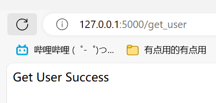

2. 查看PyCharm控制台输出

    

完整代码由于逐渐变长，请前往./Flask-Web/Demo/Demo_3/app.py中阅读


## 更新数据 UPDATE

### 代码示例

```python
@app.route('/update_user')
def update_user():
	# 查找到需要删除的对象
	user_update = User.query.filter_by(username='firefly').first()
	user_update.password = '我梦见一片焦土'
	# 同步到数据库中
	# 由于username='fireflt'的记录已经在add_user()中添加至sessions，因此直接提交即可
	db.session.commit()

	return 'Update User Success'
```

### 代码解析

* **@app.route('/update_user')**：在访问`http://127.0.0.1:5000/update_user`时会触发视图函数`update_user()`
* **查询**：使用`filter_by`获取username为firefly的第一条记录
* **修改**：使用 句点表示法 修改该条记录的password
* **提交**：使用`db.session.commit()`提交

为何不需要像插入数据时先将ORM对象放到sessions区域？

因为在插入数据时，username为firefly的记录已经被添加至session区，因此可以直接提交

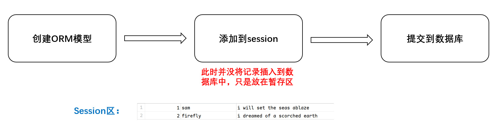

### 运行

1. 在浏览器中输入

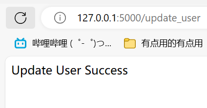

2. 查看User表

    

    

完整代码在 Flask-Web/Demo/Demo_3/app.py


## 删除数据 DELETE

### 代码示例

```python
@app.route('/delete_user')
def delete_user():
	# 查找到需要删除的对象——主键查询
	user_delete = User.query.get(1)
	# 从Sessions中删除对象
	db.session.delete(user_delete)
	# 同步到数据库中
	db.session.commit()

	return 'Delete User Success'
```


### 代码解析

* **@app.route('/get_user')**：在访问`http://127.0.0.1:5000/delete_user`时会触发视图函数delete_user()
* **获取需要删除的记录**：使用主键查询，获取id为1的记录
* **从Sessions中移除该条记录**
    * 语法：`db.session.delete(<ORM对象>)`
* **将Sessions同步到数据库中**

简单来说，我们需要先选择一个ORM对象，即一条记录，然后将这条记录从Sessions(暂存区)删除，再把Sessions与数据库同步


### 运行

1. 在浏览器中输入[127.0.0.1:5000/delete_user](http://127.0.0.1:5000/delete_user)

    

2. 查看User表

    


# Demo_4

>   知识点：**ORM模型 外键与表 的关系** 
>
> 代码位置：Flask-Web/Demo/Demo_4/app.py


## 外键

关系型数据库中一种重要的约束，用于建立表与表之间的关联关系。它定义了一个字段或一组字段，这些字段的值必须与另一个表中的主键或唯一键的值匹配

### MySQL中的外键

```mysql
FOREIGN KEY <字段名A> REFERENCES <表名>(<字段名B>)
```

```mysql
CREATE TABLE author (
    id INT PRIMARY KEY,
    name VARCHAR(80) NOT NULL
);

CREATE TABLE books (
    id INT PRIMARY KEY,
    title VARCHAR(80) NOT NULL,
    content VARCHAR(80) NOT NULL,
    author_id INT,
    FOREIGN KEY (author_id) REFERENCES authors(id)
);
```


### SQLAlchemy中的外键

```python
<字段名A> = db.Column(db.ForeignKey('<表名>.<字段名B>'))
```

```python
class Author(db.Model):
    __tablename__ = 'author'
    id = db.Column(db.Integer, primary_key=True, autoincrement=True)
    name = db.Column(db.String(80), nullable=False)

# 表：文章
class Article(db.Model):
    __tablename__ = 'article'
    id = db.Column(db.Integer, primary_key=True)
    title = db.Column(db.String(80), nullable=False)
    content = db.Column(db.Text, nullable=False)

    # 添加作者ID的外键
    author_id = db.Column(db.Integer, db.ForeignKey('author.id'))  # author_id 为外键，关联author表中的id字段
```


## SQLAlchemy的特性：建立模型之间的关系

字段名A将与ORM模型相连接，使得可以通过输出字段名B来方便地获取所有相关的联系。会 **自动处理所有相应的外键关联**

* backred：会自动给ORM模型添加一个字段B，此时可通过 **ORM模型.字段B** 来获取相关信息

```python
<字段名A> = db.relationship(<ORM模型>, backred=<字段名B>)
```

```python
class Author(db.Model):
    __tablename__ = 'author'
    id = db.Column(db.Integer, primary_key=True, autoincrement=True)
    name = db.Column(db.String(80), nullable=False)

# 表：文章
class Article(db.Model):
    __tablename__ = 'article'
    id = db.Column(db.Integer, primary_key=True, autoincrement=True)
    title = db.Column(db.String(80), nullable=False)
    content = db.Column(db.Text, nullable=False)

    # 添加作者ID的外键
    author_id = db.Column(db.Integer, db.ForeignKey('author.id'))  # author_id 为外键，关联author表中的id字段
    # 模型关系：作者与文章是一对多的关系。会自动处理外键关联
    # backref：反向引用，会自动给Article模型添加一个articles属性,可以通过Author.articles访问Article表中的数据
    author = db.relationship('Author',backref='articles')
```


## 示例

```python
from flask import Flask
from flask_sqlalchemy import SQLAlchemy
from sqlalchemy import text

## 设置app.config中关于数据库的参数
## SQLAlchemy(app)会自动从app.config中读取数据库的配置
# MySQL所在的主机名
HOSTNAME = '127.0.0.1'
# MySQL的监听端口号，默认3306
PORT = '3306'
# MySQL的用户名，在安装MySQL时由用户创建
USERNAME = 'root'
# MySQL的密码，在安装MySQL时由用户创建
PASSWORD = 'xxxx'
# MySQL的数据库名
DATABASE = 'flask-web'

# 创建app应用
app = Flask(__name__)
# 应用到app.config中
app.config['SQLALCHEMY_DATABASE_URI'] = f"mysql+pymysql://{USERNAME}:{PASSWORD}@{HOSTNAME}:{PORT}/{DATABASE}?charset=utf8"
# 连接SQLAlchemy到Flask应用
db = SQLAlchemy(app)

# 表：作者
class Author(db.Model):
    __tablename__ = 'author'
    id = db.Column(db.Integer, primary_key=True, autoincrement=True)
    name = db.Column(db.String(80), nullable=False)

# 表：文章
class Article(db.Model):
    __tablename__ = 'article'
    id = db.Column(db.Integer, primary_key=True, autoincrement=True)
    title = db.Column(db.String(80), nullable=False)
    content = db.Column(db.Text, nullable=False)

    # 添加作者ID的外键
    author_id = db.Column(db.Integer, db.ForeignKey('author.id'))  # author_id 为外键，关联author表中的id字段
    # 模型关系：作者与文章是一对多的关系。会自动处理外键关联
    # backref：反向引用，会自动给Article模型添加一个articles属性,可以通过Author.articles访问Article表中的数据
    author = db.relationship('Author',backref='articles')

# 同步至数据库
with app.app_context():
    db.create_all()

@app.route('/add_author/<name>')
def add_author(name):
    author = Author(name=name)

    # 添加到db.session中
    db.session.add(author)
    # 提交
    db.session.commit()

    return 'Add Author Success'

@app.route('/add_article')
def add_article():
    article_1 = Article(title='Firefly_1', content='我梦见一片焦土')
    article_1.author = Author.query.get(1)
    article_2 = Article(title='Firefly_2', content='一株破土而出的新蕊')
    article_2.author = Author.query.get(1)

    # 添加到db.session中
    db.session.add(article_1)
    db.session.add(article_2)
    # 提交
    db.session.commit()

    return 'Add Article Success'

@app.route('/get_author/<int:id>')
def get_article(id):
    author = Author.query.get(id)
    articles = author.articles

    for art in articles:
        print(f'Title:{art.title}, Content:{art.content}')

    return 'Get Articles Success'


if __name__ == '__main__':
    app.run(debug=True)
```


### 运行

1. 在首次运行中，会自动给 `flask-web` 架构添加两个新表：`author`和`article`

    

2. 对`author`表添加记录，访问[127.0.0.1:5000/add_author/sam](http://127.0.0.1:5000/add_author/sam)来添加作者sam

    

3. 对`article`表添加记录，访问[127.0.0.1:5000/add_article](http://127.0.0.1:5000/add_article)添加article记录

    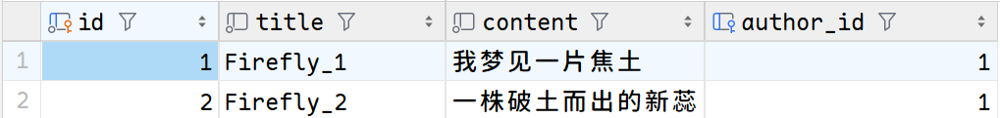

4. 此时，由于relationship的原因，可以通过访问 `.articles` 来获取指定作者的所有文章记录。访问 [127.0.0.1:5000/get_author/1](http://127.0.0.1:5000/get_author/1)获取

    


# Demo_5

>   知识点：**更好的ORM模型映射至表的方法** 
>
> 代码位置：Flask-Web/Demo/Demo_5/app.py

## db.create_all()的局限性

在Demo3和Demo4，我们使用了一下语句来将ORM模型同步到数据库中

```python
with app.app_context():
	db.create_all()
```

db.create_all()的确可以将 **新增的ORM模型** 映射至数据库，但是，若我们想要修改ORM模型中的字段，此时db.create_all()并不会将其同步，如：

```python
class Author(db.Model):
	__tablename__ = 'author'
	id = db.Column(db.Integer, primary_key=True, autoincrement=True)
	name = db.Column(db.String(80), nullable=False)

with app.app_context():
	db.create_all()
```

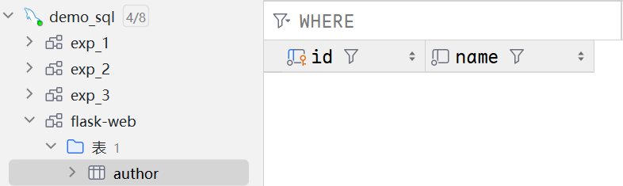

修改Author模型，新增一个age字段

```python
class Author(db.Model):
	__tablename__ = 'author'
	id = db.Column(db.Integer, primary_key=True, autoincrement=True)
	name = db.Column(db.String(80), nullable=False)
    age = db.Column(db.Integer, nullable=False)

with app.app_context():
	db.create_all()
```

此时，数据库中author表依旧为原样，无任何改变


因此，我们需要用到一个新的库，名为`flask-migrate`


## Migrate对象

Migrate对象提供了 **数据库迁移** 的功能。数据库迁移是指在开发过程中对数据库模型的改变（如添加新表、修改表结构等）后，能够方便地同步这些改变到数据库中，保持数据库与代码模型的一致性。Migrate对象来自 `flask-migrate`

### 迁移步骤

1. 创建Migrate对象，并传入app和db

    ```python
    migrate = Migrate(app, db)
    ```

2. 创建迁移仓库，在操作将会在项目目录下创建一个`migrations`文件夹，用于存放迁移脚本。该步骤仅需 **执行一次**，无需在每次ORM模型更新后执行

    ```bash
    # 使用终端输入以下指令
    flask db init
    ```

3. 生成迁移脚本。该指令会根据ORM模型生成迁移脚本，在每次更新ORM模型后 **都要执行**

    ```bash
    # 使用终端
    flask db migrate
    ```

4. 将迁移脚本同步到数据库中，在每次更新ORM模型后 **都要执行**

    ```bash
    # 使用终端
    flask db upgrade
    ```


## 示例

### 原数据库


### 更改代码——新增age字段

```python
from flask import Flask
from flask_sqlalchemy import SQLAlchemy
from flask_migrate import Migrate

## 设置app.config中关于数据库的参数
## SQLAlchemy(app)会自动从app.config中读取数据库的配置
# MySQL所在的主机名
HOSTNAME = '127.0.0.1'
# MySQL的监听端口号，默认3306
PORT = '3306'
# MySQL的用户名，在安装MySQL时由用户创建
USERNAME = 'root'
# MySQL的密码，在安装MySQL时由用户创建
PASSWORD = 'xxxx'
# MySQL的数据库名
DATABASE = 'flask-web'

# 创建app应用
app = Flask(__name__)
# 应用到app.config中
app.config['SQLALCHEMY_DATABASE_URI'] = f"mysql+pymysql://{USERNAME}:{PASSWORD}@{HOSTNAME}:{PORT}/{DATABASE}?charset=utf8"
# 连接SQLAlchemy到Flask应用
db = SQLAlchemy(app)

# 使用Migrate对象将ORM模型映射成表需要四步
# 1. 创建Migrate对象，并传入app和db
# 2. 在命令行中输入 flask db init 初始化迁移仓库，会在项目目录下生成一个migrations文件夹。该步骤仅需执行一次
# 3. 在命令行中输入 flask db migrate 生成迁移脚本，该步 骤会根据ORM模型生成迁移脚本，需要每次更新ORM模型后执行
# 4. 在命令行中输入 flask db upgrade 将迁移脚本同步到数据库中，需要每次更新ORM模型后执行
migrate = Migrate(app, db)

# 表：作者
class Author(db.Model):
	__tablename__ = 'author'
	id = db.Column(db.Integer, primary_key=True, autoincrement=True)
	name = db.Column(db.String(80), nullable=False)
	age = db.Column(db.Integer, nullable=False)  # 此字段为新增的

with app.app_context():
	db.create_all()


if __name__ == '__main__':
	app.run()

```


### 使用Migrate对象迁移ORM模型

1. **flask db init**

    * 需要先进入到app.py所在的目录，即Demo_5。可使用cd指令

    

2. **flask db migrate**

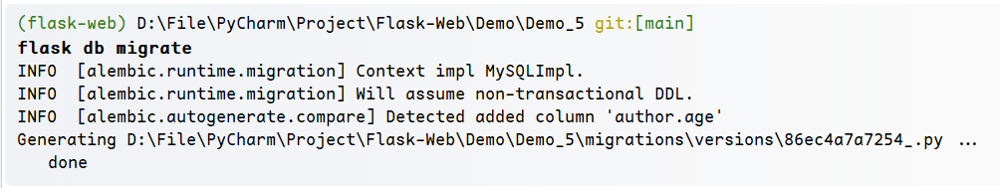

3. **flask db upgrade**

    * 可以发现，多了一个`alembic_version`表，这个表用于记录当前数据库对应着哪个迁移仓库的版本。一般而言，可以忽略

    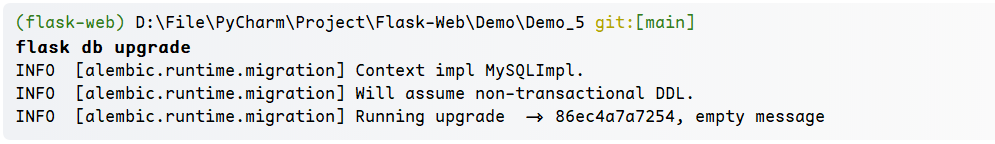

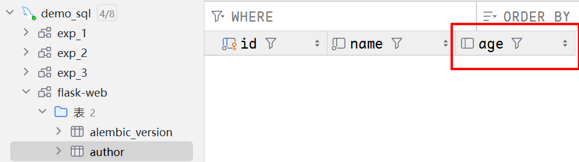


# Demo_6

>  知识点：**蓝图** 
>
> 代码位置：Flask-Web/Demo/Demo_6/app.py 

本Demo主要阐述蓝图的意义

蓝图的意义：

* 更好的管理 **路由**
* 将不同功能的Controller层分成多个文件


## 创建蓝图

```python
from flask import Blueprint

bp = Blueprint(<蓝图唯一标识名>, __name__)
```


## 将蓝图绑定app

```python
app.register_blueprint(bp)  # 无前缀url

app.register_blueprint(bp, url_prefix='/api') # 前缀url /api，表示任何路由都会有一个前缀
```


## url_for

在使用蓝图管理URL路由后，若需要用到`url_for`，**模块和HTML**  需要前面加上蓝图的名字

```python
# 原来的url_for
<form method="post" action="{{ url_for('login') }}">

url_for('home')


# 使用蓝图的url_for
<form method="post" action="{{ url_for('user.login') }}">

url_for('user.home')
```


## 示例

### 代码

```python
#############################################################
# Demo_6 实现一个简单的蓝图功能
# 蓝图位于 from flask import Blueprint
#############################################################
from flask import Blueprint, Flask

app = Flask(__name__)

bp1 = Blueprint('bp1', __name__)
bp2 = Blueprint('bp2', __name__)

@bp1.route('/bp1')
def route_bp1():
	# 访问/bp1时
	return 'bp1'

@bp2.route('/bp2')
def route_bp2():
	# 访问/api/bp2时
	return 'bp2'

if __name__ == '__main__':
	# 将蓝图与app绑定
	app.register_blueprint(bp1)
	app.register_blueprint(bp2,url_prefix='/api')

	# 输出蓝图管理的路由
	print("App应用所拥有的路由框架 ： \n",app.url_map)

	app.run(debug=True)

```


### 解析

使用了两个蓝图：`bp1`和`bp2`

其中，`bp2`使用了前缀url `/api`

对于bp1，它管理的路由为 `http://127.0.0.1:5000/bp1`

对于bp2，它管理的路由为 `http://127.0.0.1:5000/api/bp2`，即便.route('/bp2')没有前缀，但是在bp2与app链接时，提供了一个前缀url `/api`


### 运行

输出app连接的所有蓝图，以及蓝图管理的所有路由

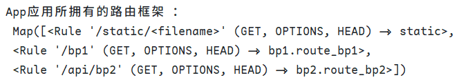
