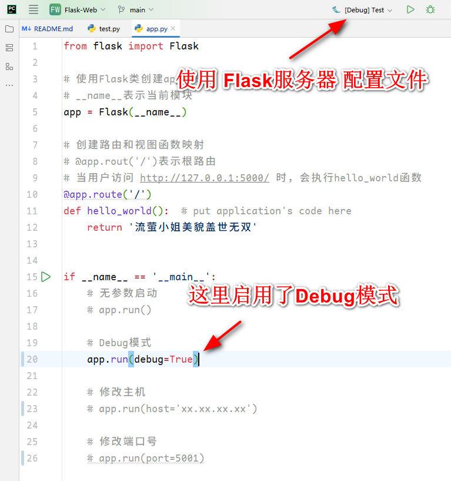
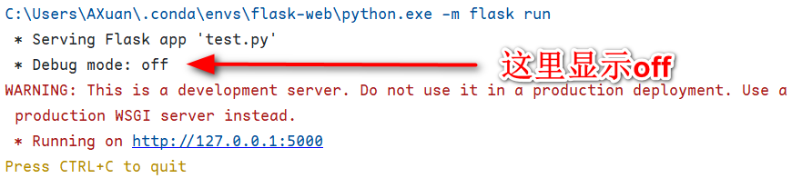
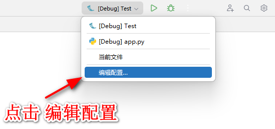

# 1.文件无法找到/打开：[Errno 2] No such file or directory  /  can't open file

## 报错内容

```bash
 * Restarting with stat
C:\Users\AXuan\.conda\envs\flask-web\python.exe: can't open file '
D:\\Program_Work\\Setup-Jetbrains\\Pycharm\\PyCharm': [Errno 2] No such file or directory
```

## 解决方案

不使用调试模式，直接运行


# 2.在app.run()传入参数后没有生效

## 问题内容







## 解决方案

使用 **Python运行配置**

1. 新建Python运行配置文件

    

    

    2.选择 **运行**

    * 注意，若使用Python的配置文件，则**不可以选择Debug**

    

    

# 3.Flask连接数据库时测试出错

报错内容：

```cmd
Traceback (most recent call last):
  File "D:\File\PyCharm\Project\Flask-Web\Demo\Demo_3\app.py", line 26, in <module>
    rs = conn.execute('select 1')
  File "C:\Users\AXuan\.conda\envs\flask-web\lib\site-packages\sqlalchemy\engine\base.py", line 1414, in execute
    raise exc.ObjectNotExecutableError(statement) from err
sqlalchemy.exc.ObjectNotExecutableError: Not an executable object: 'select 1'
```

报错代码:

```python
# 测试数据库是否已连接
with app.app_context():
	with db.engine.connect() as conn:
		rs = conn.execute('select 1')
		print(rs.fetchone())  # Success : (1,)
```

报错原因：

`select 1`并非可执行的SQLAlchemy对象，需要通过`sqlalchemy.text()`转换

解决方案：

```python
from sqlalchemy import text

... # 相关配置

# 测试数据库是否已连接
with app.app_context():
	with db.engine.connect() as conn:
		# 使用text函数将字符串转换为可执行的SQLAlchemy对象
		rs = conn.execute(text('select 1'))
		print(rs.fetchone())  # Success : (1,)
```

