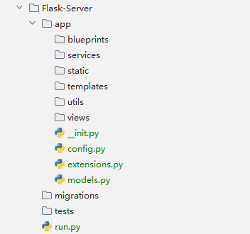
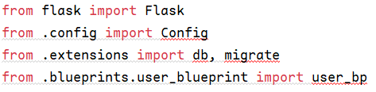

**该文档已经废弃，但放在此留作存档**

本文档主要用简单的示例来展示Flask在服务端(后端)的架构，推荐在看完所有Demo系列教程再看本文档

[TOC]


# 1.1 创建一个Flask框架项目

本章节推荐手动创建文件夹来新建项目

对于一般的Flask后端分离项目，其文件树一般是这样的

```cmd
flask-backend/
├── app/
│   ├── __init__.py
│   ├── config.py
│   ├── models.py
│   ├── views/
│   │   ├── __init__.py
│   │   ├── user_views.py
│   │   └── other_views.py
│   ├── blueprints/
│   │   ├── __init__.py
│   │   ├── user_blueprint.py
│   │   └── other_blueprint.py
│   ├── templates/
│   ├── static/
│   ├── services/
│   │   ├── __init__.py
│   │   ├── user_service.py
│   │   └── other_service.py
│   ├── utils/
│   │   ├── __init__.py
│   │   ├── helper.py
│   │   └── validators.py
│   └── extensions.py
├── tests/
│   ├── __init__.py
│   ├── test_user.py
│   └── test_other.py
├── migrations/
│   ├── versions/
│   ├── __init__.py
│   └── env.py
├── .env
├── .flaskenv
├── requirements.txt
├── run.py
└── README.md
```

但有些文件可以在用到的时候才创建，实际上可以将其创建为




# 1.2 文件结构目录说明

## app

———— blueprints：蓝图，用于模块化应用程序

———— services：服务层，用于业务逻辑和与视图的分离

———— static：静态文件目录

———— templates：模板文件目录

———— utils：实用工具函数和辅助代码

———— views：视图函数目录，包含与不同URL路由相关的视图

———— `__init__.py`：初始化应用程序，设置配置，注册蓝图和扩展

———— `config.py`：配置文件

———— `extensions.py`：扩展实例的初始化

———— `models.py`：定义数据库模型/ORM模型


## 根目录

———— migrations：数据库迁移目录

———— tests：测试文件目录

———— `run.py`：一切的起始。Flask，启动！


# 2.1 尝试编写一个简单示例

## app/\_\_init\_\_.py

### 代码示例

```python
from flask import Flask
from .config import Config
from .extensions import db, migrate
from .blueprints.user_blueprint import user_bp


def create_app():
	"""
	设置一个Flask应用并注册扩展和蓝图
	:return: Flask应用
	"""
	app = Flask(__name__)
	app.config.from_object(Config)

	register_extensions(app)
	register_blueprints(app)

	return app

def register_extensions(app):
	"""
	注册扩展
	:param app: Flask应用
	:return: None
	"""
	db.init_app(app)
	migrate.init_app(app, db)

def register_blueprints(app):
	"""
	注册蓝图
	:param app: Flask应用
	:return: None
	"""
	app.register_blueprint(user_bp)
```

</br>

### 问题

在编写完之后，会发现 **导入包有报错**



此时，不用理会，因为接下来要逐渐将这些缺失的模块补上


## app/config.py

### 代码

```python
import os

class Config:
	SECRET_KEY = os.environ.get('SECRET_KEY') or 'you-will-never-guess'
	SQLALCHEMY_DATABASE_URI = os.environ.get('DATABASE_URL') or 'sqlite:///app.db'
	SQLALCHEMY_TRACK_MODIFICATIONS = False
```


## app/extensions.py

### 代码

```python
from flask_sqlalchemy import SQLAlchemy
from flask_migrate import Migrate

db = SQLAlchemy()
migrate = Migrate()
```


## app/blueprints/user_blueprint.py

### 代码

```python
from flask import Blueprint
from ..views.user_views import UserView

user_bp = Blueprint('user_bp', __name__)

user_bp.add_url_rule('/users', view_func=UserView.as_view('users'))
```

### 解析

1. `user_bp = Blueprint('user_bp', __name__)`：创建一个名为`user_bp`的Blueprint实例

    * `user_bp`：蓝图的名称，这个名称在整个Flask应用程序中是 **唯一的**
    * `__name_`：蓝图所在模块的名称，Flask将会根据该名称来确认蓝图的位置及相关资源

2. `user_bp.add_url_rule('/users', view_func=UserView.as_view('users'))`：为蓝图`user_bp`添加一个URL规则

    * `/users`：URL路径。在访问127.0.0.1:5000/users时，会触发对应的视图函数
    * `view_func`：视图函数的参数名
    * `UserView.as_view('users')`：将UserView视图类转换为一个可以处理请求的**视图函数**，其中`users`是视图函数的名称，在Flask应用程序中是 **唯一的**


### 何为蓝图(BluePrint)

Flask蓝图（Blueprint）是Flask框架中的一个组件，用于组织和管理应用程序的路由、视图函数、模板和静态文件等。蓝图允许你将应用程序分解成多个独立和可复用的部分，从而提高代码的可维护性和可扩展性。


​     


## app/views/user_views.py

### 代码

```python
from flask.views import MethodView
from flask import jsonify

class UserView(MethodView):
	def get(self):
		return jsonify({'message': 'Hello, User!'})
```


## Flask-Server/run.py

### 代码

```python
from app import create_app

app = create_app()

if __name__ == '__main__':
    app.run()
```


# 2.2 每个模块的作用

## app/\_\_init\_\_.py

这是一个 **工厂函数**。工厂函数是一种编程模式，通常用于创建对象或类的实例。它是一种函数，其主要目的是根据传入的参数或条件来动态地生成不同类型的对象。简单来说，把一些代码 **封装** 在该文件里供应用起始模块调用，提高其简洁性

**\_\_init\_\_.py** 这种命名规则使app目录成为 **包目录**，此时app将可以当作python包一样被导入，如`import app`。除此之外，在导入包时，`__init_.py`会自动执行

因此在 **run.py** 的导入包环节 `from app import create_app` 实际上导入的是`app/__init__.py`的create_app函数


## app/config.py

该模块里定义了一个类 `class Config`。这个类中存放着与数据库有关的信息，在create_app函数中，会使用`app.config.from_object(Config)`来将配置参数载入到app中


## app/extensions.py

该模块定义了数据库 `db` 和迁移仓库 `migrate`，供其他模块调用


## app/blueprints/user_blueprint.py

