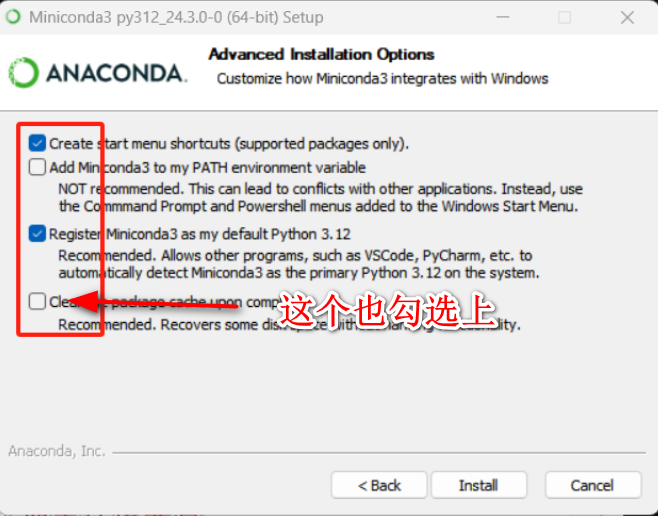
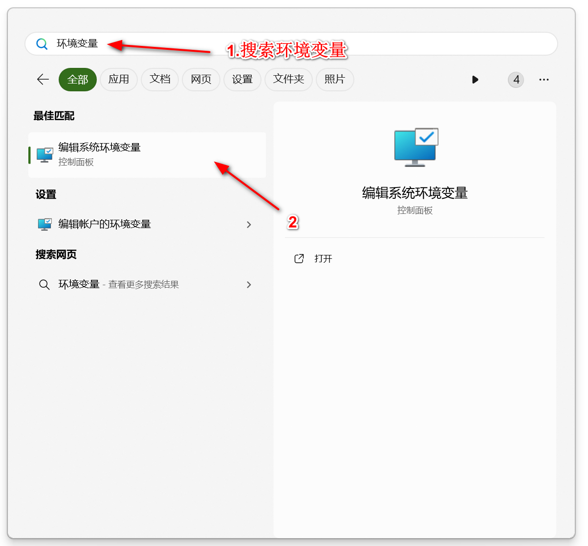
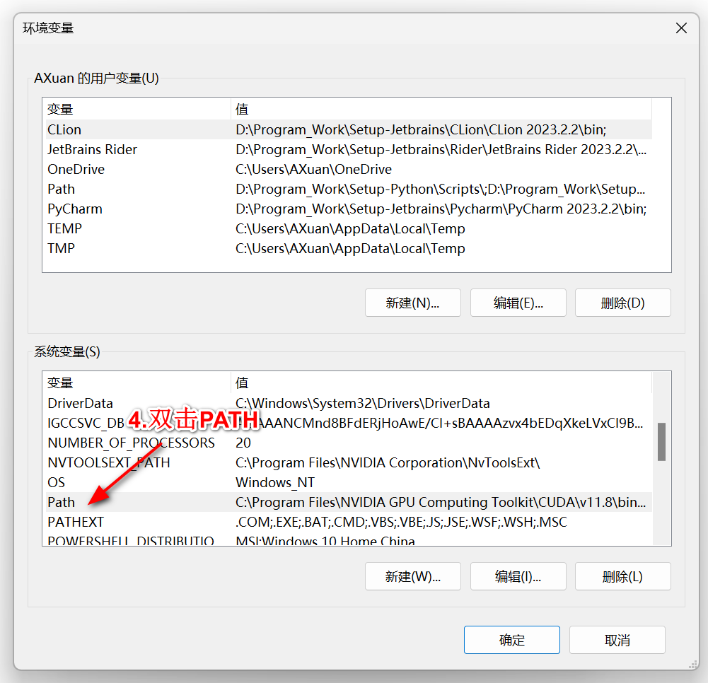
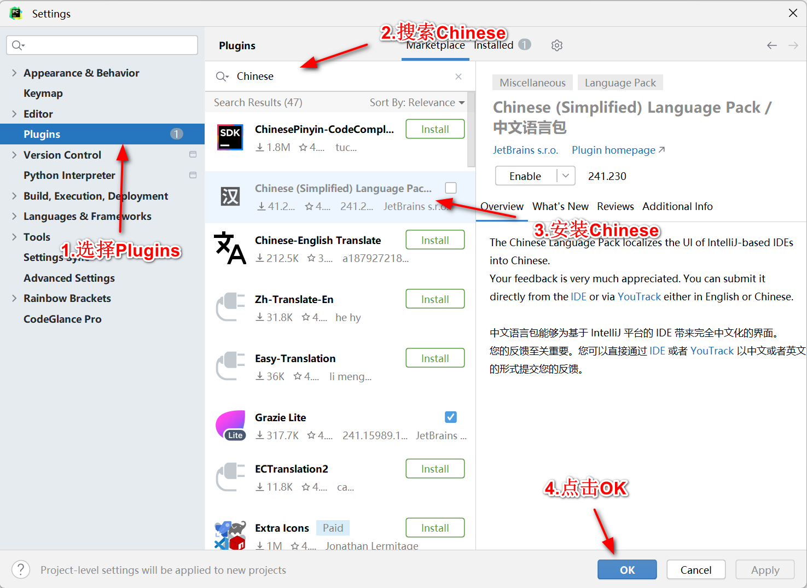
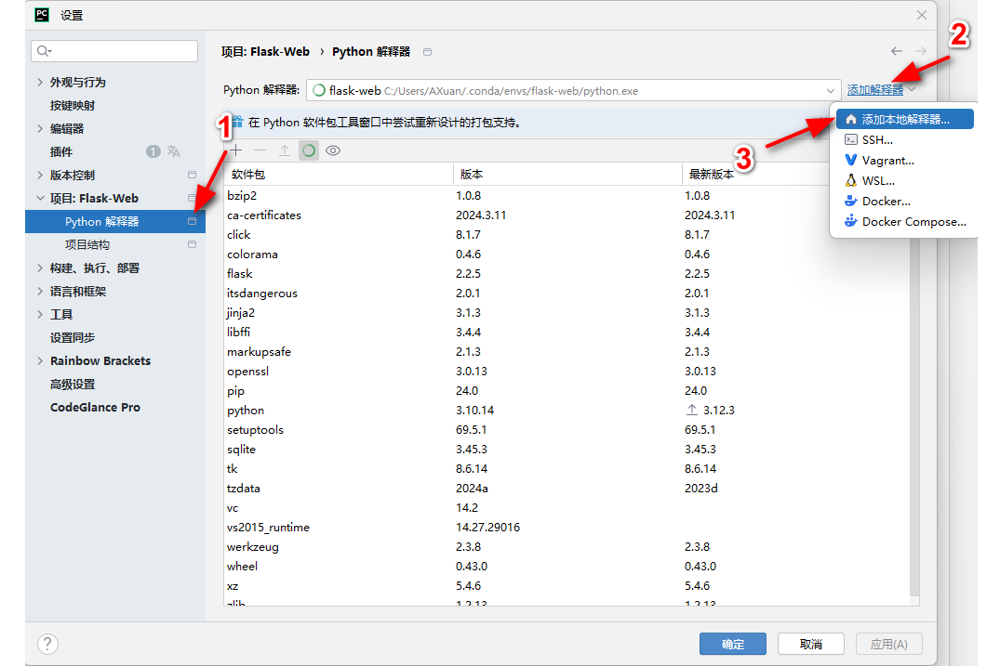
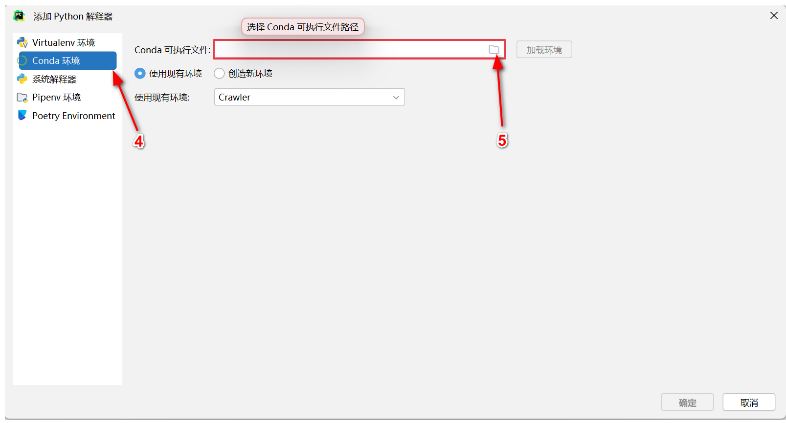
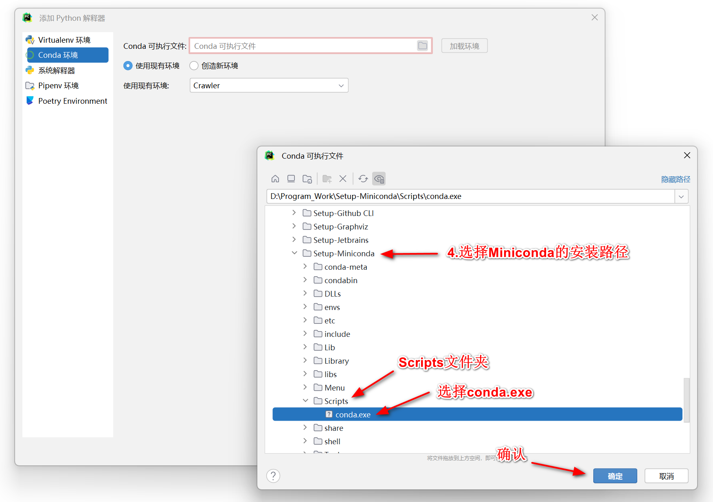
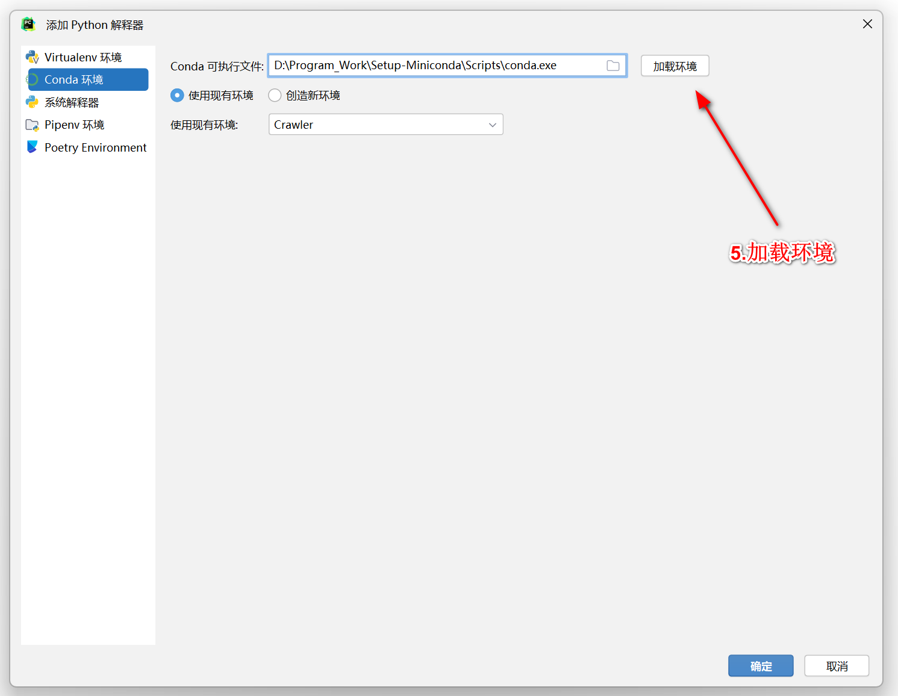

# 安装Miniconda

## 环境配置

**Windows 11**

**PyCharm**

1. 下载Miniconda

   > Miniconda是一个用于管理Python虚拟环境的工具，在不同项目之间可以将环境隔离。流萤小姐极力推荐

    ```
    https://repo.anaconda.com/miniconda/Miniconda3-latest-Windows-x86_64.exe
    ```

    * 安装勾选时建议所有带着 **Recommend** 的都勾选

       

    * **务必记得安装路径**

    

2. 将Miniconda添加至环境变量中

    * 按下Windows键，在搜索框内搜索 **编辑系统环境变量**，选择 **环境变量(N)...**

        

        

    * 找到 **系统变量(S)** 中的 `Path`，并双击进入

        

    * 点击 **新建(N)**，添加两条环境变量:

        

        ```bash
        PATH\condabin
        PATH\Scripts
        
        ### 举例 ###
        # PATH为Miniconda的安装路径
        # 假设：PATH为D:\Program_Work\Setup-Miniconda
        
        # 添加环境变量
        D:\Program_Work\Setup-Miniconda\condabin
        D:\Program_Work\Setup-Miniconda\Scripts
        ```

    

3. 查看是否成功安装Miniconda

    ```bash
   # 键盘按Win + R键，输入cmd按回车，再输入以下内容
    conda --version
   # 如果输出conda和对应版本号，说明安装成功
   ```


# 安装PyCharm

  * 下载安装Pycharm Community，注意 **安装路径不能有空格或者特殊字符**

        ```bash
        # 下载地址
        https://download-cdn.jetbrains.com/python/pycharm-community-2024.1.1.exe
        ```
      
    * [Optional] 添加插件

        * 快捷键 `Ctrl + ,` 或者 `Ctrl + Alt + S` 打开设置
        
        * 选择 **Plugins > Marketplace**
        
            
        
            * 好用的插件有 : `Chinese`，`Github Theme`，`Rainbow Brackets`，`VSCode Keymap`，`CodeGlance Pro`
            

# 在PyCharm内添加虚拟环境

1. 新建/打开已有项目
   
2. 快捷键 `Ctrl + ,` 打开设置
   
3. 点击 **项目:[你的项目名]** >  **Python解释器** >  **添加解释器**  >  **添加本地解释器**
        


        
4. 左边选择 **Conda环境**，可执行文件选择`[Path_To_Miniconda]\Scripts\conda.exe`
        


        


        


        

5. 选择 **使用现有环境** ，在下拉框中选择 `flask-web`，点击确认
        

