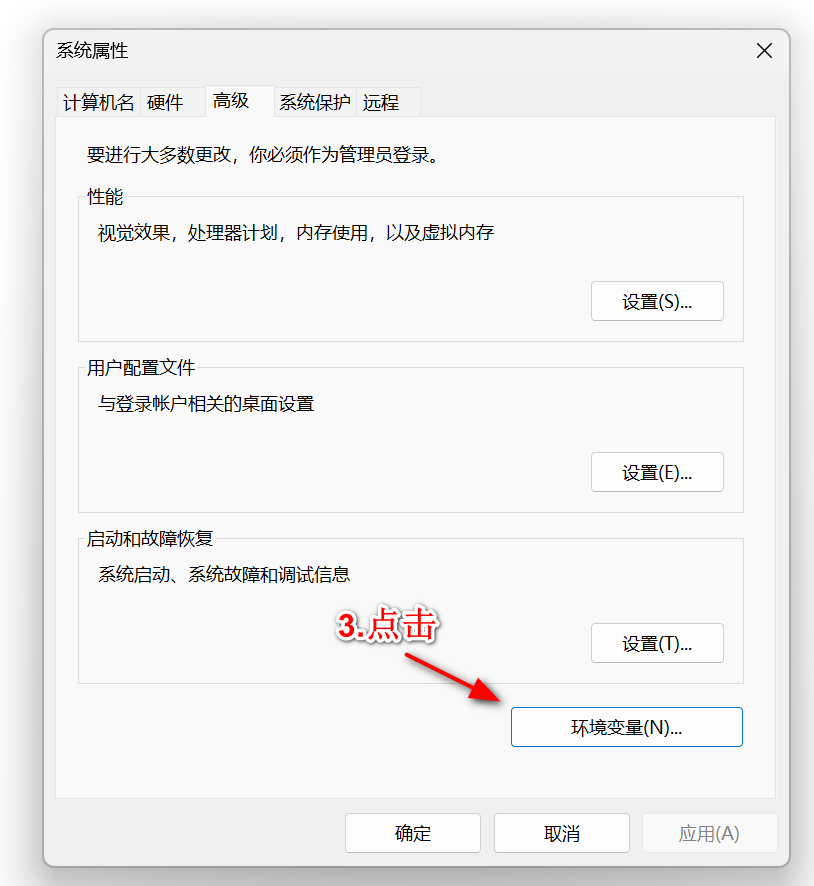
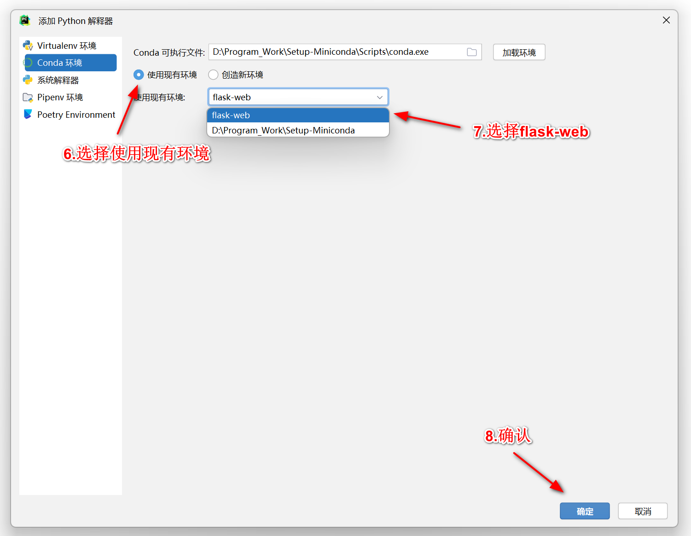
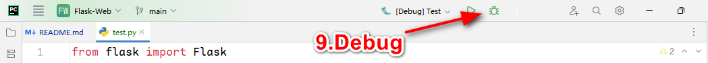

# Flask-Web

## 项目介绍

**本项目强烈建议Clone下来阅览**

markdown：可以用 PyCharm直接打开  ||  VSCode装markdown插件查看  ||  VNote  ||  Typora

Demo文件夹的例子均为可以调用，入口均为app.py


~~你是否承认，流萤小姐的盛世美貌盖世无双!~~


## 项目文件结构

Flask-Web

——Demo **例子**

————Demo_1 **Debug模式、Host | Port修改**

————Demo_2 **URL与视图函数**


——Docs **文档**

————QA.md **项目出现报错时可以到这个文件 Ctrl + F 搜索一下**

————Demo解析.md **Demo的例子解析，关于Flask的知识点**


## 环境配置

**Windows 11**

**PyCharm**

1. 下载Miniconda

   > Miniconda是一个用于管理Python虚拟环境的工具，在不同项目之间可以将环境隔离。流萤小姐极力推荐

    ```
    https://repo.anaconda.com/miniconda/Miniconda3-latest-Windows-x86_64.exe
    ```

    * 安装勾选时建议三个全部勾选
    * **务必记得安装路径**

    

2. 将Miniconda添加至环境变量中

    * 按下Windows键，在搜索框内搜索 **编辑系统环境变量**，选择 **环境变量(N)...**

        

        

    * 找到 **系统变量(S)** 中的 `Path`，并双击进入

        

    * 点击 **新建(N)**，添加两条环境变量:

        

        ```bash
        PATH\condabin
        PATH\Scripts
        
        ### 举例 ###
        # PATH为Miniconda的安装路径
        # 假设：PATH为D:\Program_Work\Setup-Miniconda
        
        # 添加环境变量
        D:\Program_Work\Setup-Miniconda\condabin
        D:\Program_Work\Setup-Miniconda\Scripts
        ```

    

3. 打开CMD并导航到项目目录

    ```bash
   # 键盘按Win + R键，输入cmd按回车，再输入以下内容
    conda --version
   # 如果输出conda和对应版本号，说明安装成功
    
    ```

    

4. 创建虚拟环境
   * 按Win + R键输入cmd然后回车，再依次输入下列内容
     
 
    ```bash
    conda create -n flask-web python=3.10 -y
    
    conda activate flask-web
    
    conda install flask -y 
    ```

    

5. 编译器配置

    * 下载安装Pycharm Community

        ```bash
        # 下载地址
        https://download-cdn.jetbrains.com/python/pycharm-community-2024.1.1.exe
        ```
        
    * [Optional] 添加插件

        * 快捷键 `Ctrl + ,` 打开设置
        
        * 选择 **Plugins > Marketplace**
        
            
        
            * 好用的插件有 : `Chinese`，`Github Theme`，`Rainbow Brackets`，`VSCode Keymap`，`CodeGlance Pro`
        
    * 在编译器内添加虚拟环境
    
        * 新建/打开已有项目
        
        * 快捷键 `Ctrl + ,` 打开设置
        
        * 点击 **项目:[你的项目名]** >  **Python解释器** >  **添加解释器**  >  **添加本地解释器**
        
            
        
        * 左边选择 **Conda环境**，可执行文件选择`[Path_To_Miniconda]\Scripts\conda.exe`
        
            
        
            
        
            
        
        * 选择 **使用现有环境** ，在下拉框中选择 `flask-web`，点击确认
        
            
        
            
    
    

## [Optional] 测试

1. 在项目目录下新建`test.py`，并复制以下内容

    ```python
    from flask import Flask
      
    # 创建Flask应用实例
    app = Flask(__name__)
      
    @app.route('/')
    def hello_world():
        return 'Hello, World!'
      
    if __name__ == '__main__':
        app.run(debug=True)
    ```

2. 选择PyCharm上方的 **当前文件 > 编辑配置**

  

3. 点击 **+号**，并选择 **Flask服务器**

    * 经测试，选择**Python**配置完成以下相同步骤也可以执行
    * Python配置和Flask服务器配置各有优缺点
        * Python配置 **Debug(虫子标志)** 会报错，但 **Run(三角形标志)** 能够正常运行，且在向`app.run()`传入参数时能够正常识别，传入参数知识点详细看[Demo_1](.\Docs\Demo解析.md#Demo_1)。Python配置方式详细看[Python运行配置](./Docs/问题大全.md#2.在app.run()传入参数后没有生效)
        * Flask服务器配置在**Debug(虫子标志)**和**Run(三角形标志)** 都能够正常运行，但无法向`app.run()`传入参数，会无法识别


4. 填写相应信息

    

5. Debug，并打开网址:http://127.0.0.1:5000 ，显示`Hello World`

    

​       

## Flask-Web项目构建

--> ./Docs (temp)


