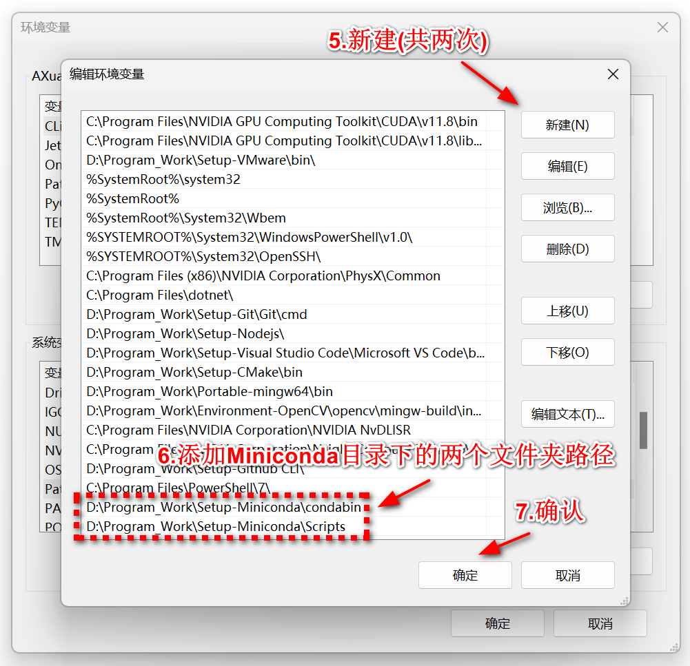
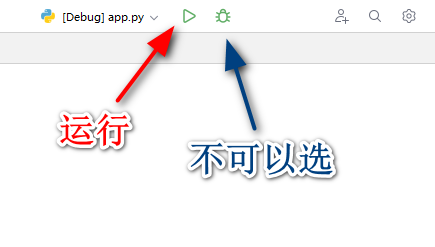

# Flask-Web

## 项目介绍

**本项目强烈建议Clone下来阅览**

markdown：可以用 PyCharm直接打开  ||  VSCode装markdown插件查看  ||  VNote  ||  Typora

Demo文件夹的例子均为可以调用，入口均为app.py


TODO：

1.英文/俄语的Readme.md

2.Demo整合

3.软件推荐


~~你是否承认，流萤小姐的盛世美貌盖世无双!~~


## 项目文件结构

Flask-Web

——Demo **例子**

————Demo_1 **Debug模式、Host | Port修改**

————Demo_2 **URL与视图函数**

————Demo_3 **Flask与数据库的连接 | ORM模型**

————Demo_4 **ORM模型外键与表的关系**

————Demo_5 **更好的ORM模型映射表的方法**


——Docs **文档**

————QA.md **项目出现报错时可以到这个文件 Ctrl + F 搜索一下**

————Demo解析.md **Demo的例子解析，认真阅读即可熟悉Flask框架**

————扩展信息.md **杂项**


## 环境配置

**Windows 11**

**PyCharm**

1. 下载Miniconda

   > Miniconda是一个用于管理Python虚拟环境的工具，在不同项目之间可以将环境隔离。流萤小姐极力推荐

    ```
    https://repo.anaconda.com/miniconda/Miniconda3-latest-Windows-x86_64.exe
    ```

    * 安装勾选时建议所有带着 **Recommend** 的都勾选

       

    * **务必记得安装路径**

    

2. 将Miniconda添加至环境变量中

    * 按下Windows键，在搜索框内搜索 **编辑系统环境变量**，选择 **环境变量(N)...**

        

        

    * 找到 **系统变量(S)** 中的 `Path`，并双击进入

        

    * 点击 **新建(N)**，添加两条环境变量:

        

        ```bash
        PATH\condabin
        PATH\Scripts
        
        ### 举例 ###
        # PATH为Miniconda的安装路径
        # 假设：PATH为D:\Program_Work\Setup-Miniconda
        
        # 添加环境变量
        D:\Program_Work\Setup-Miniconda\condabin
        D:\Program_Work\Setup-Miniconda\Scripts
        ```

    

3. 查看是否成功安装Miniconda

    ```bash
   # 键盘按Win + R键，输入cmd按回车，再输入以下内容
    conda --version
   # 如果输出conda和对应版本号，说明安装成功
   ```
   
    
   
4. 创建虚拟环境
   * 按Win + R键输入cmd然后回车，再依次输入下列内容
     

    ```bash
    conda create -n flask-web python=3.10 -y
    
    conda activate flask-web
    
    conda install flask pymysql flask-sqlalchemy -y 
    
    pip install flask-migrate
    ```

    接着在终端输入 `conda list` 检查环境中的包是否安装齐备
    ```bash
      # packages in environment at E:\Anaconda\envs\flask-web:
      #
      # Name                    Version                   Build  Channel
      alembic                   1.13.1                   pypi_0    pypi
      blinker                   1.8.2                    pypi_0    pypi
      bzip2                     1.0.8                h2bbff1b_6    defaults
      ca-certificates           2024.3.11            haa95532_0    defaults
      cffi                      1.16.0          py310h2bbff1b_1    defaults
      click                     8.1.7                    pypi_0    pypi
      colorama                  0.4.6                    pypi_0    pypi
      cryptography              42.0.5          py310h89fc84f_1    defaults
      flask                     3.0.3                    pypi_0    pypi
      flask-migrate             4.0.7                    pypi_0    pypi
      flask-sqlalchemy          3.1.1                    pypi_0    pypi
      greenlet                  3.0.3                    pypi_0    pypi
      itsdangerous              2.2.0                    pypi_0    pypi
      jinja2                    3.1.4                    pypi_0    pypi
      libffi                    3.4.4                hd77b12b_1    defaults
      mako                      1.3.5                    pypi_0    pypi
      markupsafe                2.1.5                    pypi_0    pypi
      openssl                   3.0.13               h2bbff1b_1    defaults
      pip                       24.0            py310haa95532_0    defaults
      pycparser                 2.21               pyhd3eb1b0_0    defaults
      pymysql                   1.0.2           py310haa95532_1    defaults
      python                    3.10.14              he1021f5_1    defaults
      setuptools                69.5.1          py310haa95532_0    defaults
      sqlalchemy                2.0.30                   pypi_0    pypi
      sqlite                    3.45.3               h2bbff1b_0    defaults
      tk                        8.6.14               h0416ee5_0    defaults
      typing-extensions         4.11.0                   pypi_0    pypi
      tzdata                    2024a                h04d1e81_0    defaults
      vc                        14.2                 h2eaa2aa_1    defaults
      vs2015_runtime            14.29.30133          h43f2093_3    defaults
      werkzeug                  3.0.3                    pypi_0    pypi
      wheel                     0.43.0          py310haa95532_0    defaults
      xz                        5.4.6                h8cc25b3_1    defaults
      zlib                      1.2.13               h8cc25b3_1    defaults
    ````
    
   
5. 编译器配置

    * 下载安装Pycharm Community，注意 **安装路径不能有空格或者特殊字符**

        ```bash
        # 下载地址
        https://download-cdn.jetbrains.com/python/pycharm-community-2024.1.1.exe
        ```
        
    * [Optional] 添加插件

        * 快捷键 `Ctrl + ,` 或者 `Ctrl + Alt + S` 打开设置
        
        * 选择 **Plugins > Marketplace**
        
            
        
            * 好用的插件有 : `Chinese`，`Github Theme`，`Rainbow Brackets`，`VSCode Keymap`，`CodeGlance Pro`
        
    * 在编译器内添加虚拟环境
    
        * 新建/打开已有项目
        
        * 快捷键 `Ctrl + ,` 打开设置
        
        * 点击 **项目:[你的项目名]** >  **Python解释器** >  **添加解释器**  >  **添加本地解释器**
        
            
        
        * 左边选择 **Conda环境**，可执行文件选择`[Path_To_Miniconda]\Scripts\conda.exe`
        
            
        
            
        
            
        
        * 选择 **使用现有环境** ，在下拉框中选择 `flask-web`，点击确认
        
            
        
            

    

## [可选] 测试

1. 在项目目录下新建`test.py`，并复制以下内容

    ```python
    from flask import Flask
      
    # 创建Flask应用实例
    app = Flask(__name__)
      
    @app.route('/')
    def hello_world():
        return 'Hello, World!'
      
    if __name__ == '__main__':
        app.run(debug=True)
    ```

2. 选择PyCharm上方的 **当前文件 > 编辑配置**

  

3. 点击 **+号**，并选择 **Python**

    * Python配置 **Debug(虫子标志)** 会报错，但 **Run(三角形标志)** 能够正常运行，且在向`app.run()`传入参数时能够正常识别，传入参数知识点详细看[Demo_1](.\Docs\Demo解析.md#Demo_1)。./Docs/QA.md#2.在app.run()传入参数后没有生效)


4. 填写相应信息

    

5. **RUN**，并打开网址:http://127.0.0.1:5000 ，显示`Hello World`

    

   

## Flask-Web项目构建

--> ./Docs (temp)


