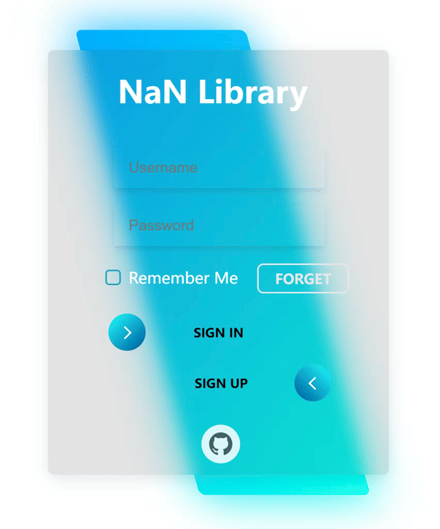
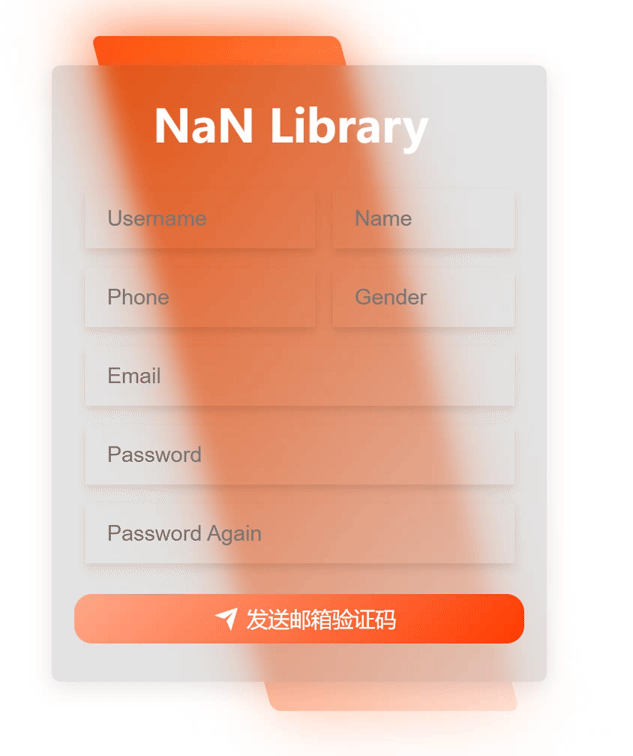
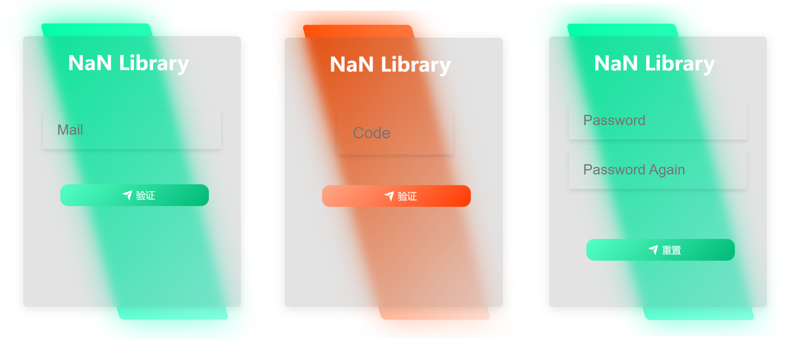
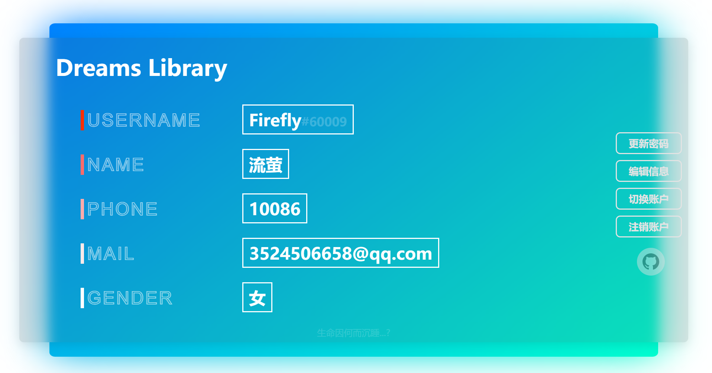

# Flask-Web

## 项目介绍

本项目为 **图书管理系统** ，类似于[Z-Library](https://z-library.cc/)或[豆瓣读书](https://book.douban.com/)等网站，但主要实现的是服务端

代码实现部分在 **Code** 文件夹

 

看点：

* 基于深度学习的图书推荐(测试中)
* 邮箱验证码
* 登陆保持
* ....

 

目前的分支是 **Jinja** ，也是默认分支，前后端并不分离

若想阅览前后端分离版本，请转至 **only-server** 分支

 

感谢  [YuXeng](https://github.com/YusJade) 与 [Serendipity](https://github.com/Serendipity-hjn) 对本项目的贡献

 

 

## 预览

本项目主要实现的是Web服务端，前端仅仅做了一部分提供参考

 

 | 

 

 

